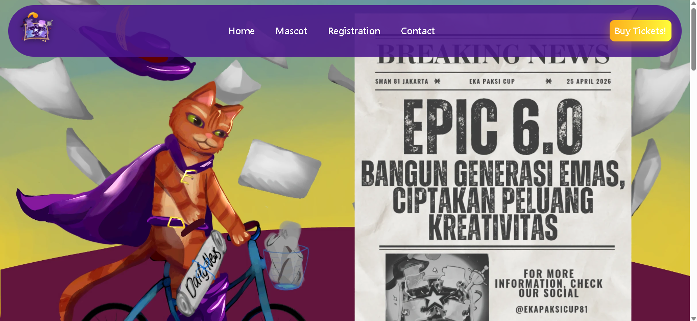

# EPIC 6.0 Registration System

A full-stack event registration and QR verification system built for **EPIC 6.0**.

This project was designed to handle:

- Google form registration through cards
- Online ticket purchases
- QR ticket generation
- Email ticket delivery
- QR-based check-in verification
- Attendance system with rotating OTP
- Admin and operational tooling for event day

---

# ✨ Features

## 🎫 Ticketing System

- Online ticket purchase flow
- Multiple ticket categories support
- PDF ticket generation
- Unique QR code generation
- Supabase-backed ticket storage

## 📧 Email Delivery

- Automatic ticket email delivery using Resend
- Bulk approved-order processing
- Manual resend/recovery tools
- Bounce recovery support

## 📷 QR Verification System

- Real-time QR scanning
- Duplicate ticket prevention
- Used/unused ticket validation
- Mobile-friendly verifier
- Sound feedback support
- Camera switching support

## 🧾 Attendance System

- Rotating OTP attendance validation
- Google Sheets integration
- Live OTP display
- Anti-spam submission handling

## 🛠️ Admin & DevTools

- Admin dashboard
- Backfill and recovery scripts
- Manual ticket/order reconstruction support
- Single-order resend utilities

---

# 🧱 Tech Stack

## Frontend

- HTML
- CSS
- Vanilla JavaScript

## Backend

- Node.js
- Express.js

## Database & Storage

- Supabase

## Email Service

- Resend

## QR & PDF

- qrcode
- pdf-lib
- html5-qrcode

## Deployment

- Railway

---

# 📂 Project Architecture

```text
Epic-Registration/
│
├── client/
│   │
│   ├── admin/
│   │   ├── admin.html
│   │   ├── admin.css
│   │   └── admin.js
│   │
│   ├── attendance/
│   │   ├── attendance.html
│   │   ├── attendance.css
│   │   ├── attendance.js
│   │   │
│   │   ├── otp.html
│   │   ├── otp.css
│   │   └── otp.js
│   │
│   ├── verifier/
│   │   ├── verify.html
│   │   ├── verify.css
│   │   └── verify.js
│   │
│   ├── tickets/
│   │   ├── purchase.html
│   │   └── tickets.html
│   │
│   ├── css/
│   │   ├── style.css
│   │   ├── purchase.css
│   │   └── tickets.css
│   │
│   ├── js/
│   │   ├── script.js
│   │   ├── purchase.js
│   │   └── tickets.js
│   │
│   ├── assets/
│   │   └── sounds/
│   │
│   └── index.html
│
│
├── server/
│   │
│   ├── routes/
│   │   └── verifyTicket.js
│   │
│   ├── tickets/
│   │   └── ticket-template.png
│   │
│   ├── generateTicket.js
│   ├── sendTickets.js
│   ├── server.js
│   │
│   ├── package.json
│   └── node_modules/
│
│
├── devtools/
│   ├── backfill.js
│   ├── send-all-approved.js
│   └── sendSingleOrder.js
│
├── package.json
├── package-lock.json
└── .gitignore
```

# 📷 Screenshot

## Home Page



---

## Ticket Purchase


---

## QR Verifier


---

## Attendance System


---

## Admin Dashboard


# ⚙️ System Flow

## 🎟️ Ticket Purchase Flow

```text
User Purchase
↓
Frontend Form
↓
Backend Processing
↓
Supabase Order Storage
↓
Ticket Generation
↓
PDF + QR Creation
↓
Email Delivery
```

---

## 📷 QR Verification Flow

```text
QR Scan
↓
verify.js
↓
verify-ticket API
↓
Supabase Validation
↓
used = true
↓
Verification Result
```

---

## 🧾 Attendance Flow

```text
OTP Generator
↓
Google Apps Script
↓
attendance.js
↓
Google Sheets
```

---

# 🚀 Installation

## 1. Clone Repository

```bash
git clone <repo-url>
cd Epic-Registration
```

---

## 2. Install Dependencies

### Root

```bash
npm install
```

### Server

```bash
cd server
npm install
```

---

# 🔑 Environment Variables

Create:

```text
server/.env
```

Example:

```env
SUPABASE_URL=your_supabase_url
SUPABASE_SERVICE_ROLE=your_service_role_key
RESEND_API_KEY=your_resend_api_key
PORT=3000
```

---

# ▶️ Running Locally

## Start Backend

```bash
cd server
node server.js
```

---

## Open Frontend

Use Live Server or any static server for:

```text
client/index.html
```

---

# 🗄️ Database Structure

## orders

Stores:

- Buyer information
- Ticket category
- Payment proof
- Order status
- Email delivery state

## tickets

Stores:

- ticket_code
- QR verification state
- used timestamps
- ticket ownership

---

# 📧 Email System

The system uses Resend for transactional email delivery.

Capabilities:

- Send generated PDF tickets
- Bulk approved-order processing
- Manual resend recovery
- Bounce handling workflows

---

# 📷 Verifier System

The verifier subsystem supports:

- Real-time QR scanning
- Duplicate detection
- Cooldown handling
- Mobile camera switching
- Audio feedback
- Event-day operational usage

---

# 🛠️ DevTools

## send-all-approved.js

Processes approved orders and sends missing tickets.

## sendSingleOrder.js

Resends tickets to a specific customer.

## backfill.js

Utility script for reconstructing or repairing missing data.

---

# 🔮 Future Improvements

- Webhook-based email event tracking
- Analytics dashboard
- Multi-day ticket validation
- Admin authentication
- Queue-based email processing
- Offline verification fallback
- Real-time event statistics

---

# 📌 Notes

This project was built for a real event environment and optimized for operational reliability during event-day execution.

The system prioritizes:

- Fast QR verification
- Minimal friction for attendees
- Manual recovery capability
- Lightweight deployment
- Mobile usability

---
